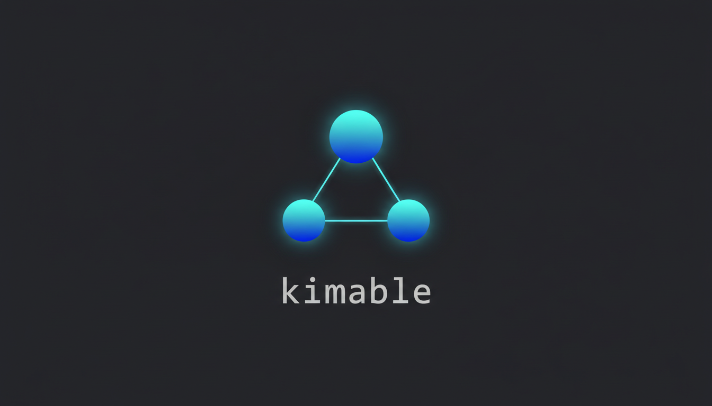

<p align="center">
  
</p>

# Claude agent for kimi delegation

Claude [`kimi-delegate`](./claude-integration/kimi-delegate.md) subagent to handoff non-architectural tasks to [kimi-code](https://www.kimi.com/code).

## Why this exists

Opus is good at architecture. Tradeoffs, implications, systems that hold up. It's less good at fifty small execution tasks in a row. And at $15 per million tokens, it shouldn't be.

What actually happens. You design an auth flow with Opus. Clean work. Then: write the endpoint, add validation, generate tests, update docs. All needs context, none needs architectural reasoning. Opus can do it. So can a model at $0.50–2 per million tokens. The gap is 10–25x. You do the math.

Agentic work amplifies the cost. Proof-checking outputs. Gap analysis between agents. Validation passes. I spent $350 in one afternoon on orchestration overhead. Not features. Not architecture. Just consistency checks. Wrong tool for the job.

Then there's the session cap. Three hours into a refactor, Claude Code hits its limit. Restart context. Re-explain. Rebuild mental state. The cap exists. Work around it or pay more. Your choice.

The reality: for routing, delegation, validation, execution within established patterns, a non-anthropic model does the work as well as Opus. Sometimes better, because it doesn't overthink. The cost difference isn't dramatic. It's just there. Persistent. Real.

I built a simpler version of this before, a Claude skill that routed to Cursor CLI. Delegation, nothing fancy. Worked fine.

When I started using Kimi, I didn't see anyone doing Claude-to-Kimi routing yet. Kimi K2.6 and kimi-code are good. Fast, capable, reliable. I wanted that same delegation pattern but with Kimi as the execution layer.

I could have built a simple pass-through agent in an afternoon. Instead I added orchestration, gap analysis, validation, retry logic, to see if it improved what Claude gets back. An experiment. The routing is the easy part. The orchestration is what I was curious about.

## Quick start

```bash
# 1. Install Kimi CLI if you haven't
curl -L code.kimi.com/install.sh | bash

# 2. Grab this repo
git clone https://github.com/mikehenken/kimable-simple-agent.git
cd kimable-simple-agent

# 3. Run a task through the orchestrator
kimi --agent kimable.yaml --prompt "Add a dark mode toggle to the settings page"
```

That's it. Kimable will read the prompt, decide it's a web-dev task with medium complexity, and hand it off to the web-dev agent. The agent works, writes to the journal, and you're done.

## The 14 subagents

The lineup. Each one is a YAML config in `agents/` that tells Kimi how to behave.

| Agent | Handles |
|---|---|
| `web-dev` | Frontend changes, React, CSS, DOM stuff |
| `api-dev` | Backend endpoints, REST, GraphQL, middleware |
| `data-science` | Notebooks, pandas, plots, model training |
| `security` | Audits, dependency scanning, threat modeling |
| `devops` | Docker, CI configs, deploy scripts, Terraform |
| `docs` | README updates, docstrings, API docs |
| `test` | Unit tests, integration tests, test data |
| `refactor` | Dead code removal, renames, structural cleanup |
| `design` | UI/UX reviews, accessibility checks, spacing |
| `research` | Deep dives, RFCs, comparison tables, due diligence |
| `migration` | Framework upgrades, database migrations, rewrites |
| `debug` | Error tracing, log analysis, root cause investigation |
| `cli` | Shell scripts, CLI tools, argument parsing, piping |
| `integration` | Third-party APIs, webhooks, SDK wrangling |

Most tasks only need one. Big refactors might loop in `refactor`, `test`, and `docs`. Research-heavy features might start with `research`, then pass to `api-dev`. You don't pick them by hand. The orchestrator does that from your prompt.

## Configuration

Kimable looks for a block like this at the top of your prompt or in a plan file:

```yaml
@kimable
complexity: medium    # low / medium / high
effort: 2h            # rough time estimate
max-agents: 3         # hard cap on parallel agents
```

The orchestrator uses `complexity` to decide whether a task is a quick one-agent job or something that needs multiple specialists. `effort` is just a hint. The agent may ignore it if the work turns out to be bigger or smaller. `max-agents` keeps things from spiraling. Even if your prompt mentions six different systems, Kimable won't spin up more than the cap.

If you don't specify anything, the defaults are `medium`, `1h`, and `2` agents. Fine for most PR-sized tasks.

## Plan files

Sometimes you already know the steps. Write a plan file and Kimable will follow it instead of improvising.

```yaml
# plans/add-oauth.yaml
@kimable
complexity: high
max-agents: 3

steps:
  - agent: research
    prompt: "Compare OAuth2 providers: Google, GitHub, Discord. Pick one."
  - agent: api-dev
    prompt: "Implement the auth callback and JWT session handling"
  - agent: web-dev
    prompt: "Add the login button and callback route"
  - agent: test
    prompt: "Write tests for the auth flow"
```

Run it with:

```bash
kimi --agent kimable.yaml --plan plans/add-oauth.yaml
```

Each step runs in order. The orchestrator waits for one to finish and journal its output before starting the next. You can still override with `--prompt` if you want to add context on the fly.

## Installation

### Option 1: npx (fastest, no clone)

```bash
# Install everything to ~/.kimable + Claude subagent
npx github:mikehenken/kimable-simple-agent

# Install only the Claude subagent
npx github:mikehenken/kimable-simple-agent --claude

# Install system-wide (requires permission for /opt)
sudo npx github:mikehenken/kimable-simple-agent --global

# Install and validate immediately
npx github:mikehenken/kimable-simple-agent --check
```

**Security: This script is served from GitHub. For behavioral analysis of npx scripts, see [Socket.dev](https://socket.dev). Free scanning for open source packages. They detect malware, telemetry, and suspicious network calls in npm packages. Manual verification: review `scripts/install.js` before running.

### Option 2: Claude Code plugin (proper install)

Claude Code v1.0.33+ supports plugins via the `/plugin` command. Kimable is packaged as a proper Claude Code plugin with manifest, agent, and slash command.

**Add this repo as a plugin marketplace source:**

```bash
# In your terminal (outside Claude Code)
claude plugin marketplace add github:mikehenken/kimable-simple-agent

# Or add a local path if you cloned manually
claude plugin marketplace add /path/to/kimable-simple-agent
```

**Then inside Claude Code:**

```
/plugin                          # browse available plugins
/plugin install kimable-delegate # install from the marketplace you just added
```

**What you get:**
- `@kimi-delegate` agent — full delegation with prompt formatting
- `/delegate` slash command — quick delegation with context capture
- Auto-validation that `kimi` CLI is installed and responsive

**Uninstall:**

```
/plugin uninstall kimable-delegate
```

### Option 3: Manual install (no magic)

```bash
# 1. Install Kimi CLI
curl -fsSL https://www.kimi.com/code/install.sh | bash

# 2. Clone this repo
git clone https://github.com/mikehenken/kimable-simple-agent.git ~/.kimable

# 3. Install Claude subagent (old way, still works)
mkdir -p ~/.claude/agents
cp ~/.kimable/claude-integration/kimi-delegate.md ~/.claude/agents/

# 4. Or install as proper Claude plugin (recommended)
cd ~/.kimable && claude plugin install .

# 5. (Optional) Add shell alias
echo 'alias kb="kimi --agent ~/.kimable/kimable.yaml"' >> ~/.bashrc
```

**Plugin structure** (for verification):

```
kimable-simple-agent/
├── .claude-plugin/
│   └── plugin.json          # Plugin manifest
├── agents/
│   └── kimi-delegate.md     # Subagent definition
├── commands/
│   └── delegate.md          # /delegate slash command
├── kimable.yaml             # Orchestrator config
├── orchestrator/
│   └── system.md            # Orchestrator system prompt
└── subagents/               # 14 agent configs
    └── ...
```

### Option 4: Cross-system / team install

```bash
# Shared install for teams
sudo git clone https://github.com/mikehenken/kimable-simple-agent.git /opt/kimable
sudo ln -s /opt/kimable/scripts/test.js /usr/local/bin/kimable-test

# Set environment
export KIMABLE_HOME=/opt/kimable
```

## Test your setup

One command. Shows everything that happens under the hood:

```bash
npx github:mikehenken/kimable-simple-agent/scripts/test.js
```

Or if you cloned the repo locally:

```bash
node scripts/test.js
```

This runs a full diagnostic of your pipeline and prints verbose output from every check:

```
═══ Check 1: Kimi CLI Installation ═══
[FOUND] kimi CLI is installed
[kimi --version] kimi-cli 1.2.3

═══ Check 2: Repository Structure ═══
[PASS] kimable.yaml exists
  Size: 2847 bytes
[PASS] orchestrator/system.md exists
  Lines: 497
[PASS] claude-integration/kimi-delegate.md exists
  Size: 8934 bytes
[COUNT] 14 subagents found in subagents/
  - market-researcher: ok
  - nextjs-developer: ok
  - python-pro: ok
  ...

═══ Check 3: Kimable Config Load ═══
[LOADED] kimable.yaml loaded and executed
[kimi] Agent: python-pro | Task: list files | Result: 42 files found

═══ Check 4: Claude Code Integration ═══
[PASS] Claude agents directory exists
[PASS] kimi-delegate agent installed
  Installed size: 8934 bytes
[SYNC] Installed agent matches repo version

═══ Check 5: Observability ═══
[JOURNAL] journal.md exists (156 lines)
[JSONL] .kimi/logs/runs.jsonl exists (23 entries)
  Last 3 entries:
    1. agent_complete | 2024-06-15T09:24:12Z
    2. validation_pass | 2024-06-15T09:24:15Z
    3. plan_complete | 2024-06-15T09:26:47Z

═══ Check 6: Agent YAML Validation ═══
[VALID] market-researcher: market-researcher (3 tools)
[VALID] nextjs-developer: nextjs-developer (2 tools)
...
[VALID] fullstack-developer: fullstack-developer (2 tools)

═══ Check 7: Orchestrator Manifest ═══
[MANIFEST] 14 subagents registered
  - market-researcher → subagents/market-researcher/ ok
  - nextjs-developer → subagents/nextjs-developer/ ok
  ...

═══ Summary ═══
Total checks:  17
Passed:        17
Failed:        0

All checks passed. Kimable is ready.
```

What it checks:
1. **Kimi CLI**: installed, responsive, version known
2. **Repo structure**: all config files present, subagents counted
3. **Config load**: `kimable.yaml` loads, simple task executes, output shown
4. **Claude integration**: agent directory exists, `kimi-delegate.md` installed, version sync
5. **Observability**: journal and JSONL logs exist, last entries displayed
6. **Agent validation**: every `agent.yaml` parsed, required keys verified
7. **Manifest sync**: `kimable.yaml` subagents match directory contents, no orphans

If something fails, the output tells you exactly what's wrong and how to fix it. No guessing.

## Claude code integration

### Claude → Kimable: delegation

If you use Claude Code with Opus for architecture, route execution to Kimable via the `kimi-delegate` subagent.

**Install the subagent:**

```bash
# Option A: npx (one-liner)
npx github:mikehenken/kimable-simple-agent --claude

# Option B: manual
cp ~/.kimable/claude-integration/kimi-delegate.md ~/.claude/agents/
```

**Authenticate Claude Code (run locally on your machine):**

```bash
# Install Claude Code
curl -fsSL https://claude.ai/install.sh | bash

# Authenticate with your API key
export ANTHROPIC_API_KEY=sk-ant-oat01-...
claude auth

# Or use the login flow
claude login
```

**Use it:**

```
@kimi-delegate "Write tests for the auth module we just designed"
```

Claude captures context, formats the request, sends to Kimable's orchestrator. Result returns in your Claude session.

### Kimable → Claude Code: escalation

Reverse direction: when Kimable scores a task as high complexity or hits architectural territory, it returns `escalation_recommended` with partial deliverables. You take that context back to Claude Code for the design work.

The flow is bidirectional. Claude designs. Kimable executes. Kimable escalates. Claude decides.

## Auto-delegation

By default, `@kimi-delegate` only runs when you type it. Install the auto-delegation hook if you want Kimable to intercept implementation work automatically. The hook is installed by default but **disabled per-session** until you turn it on.

### How it works

The hook runs on every prompt before your tool processes it. It does two checks:

1. **Is auto-delegation enabled?** Checks `KIMABLE_USE_HOOK=1` env var, or a session state file at `~/.kimable/session-state/{platform}-{session-id}.json`
2. **Is this implementation work?** Checks if the prompt contains keywords like "write", "add test", "refactor", etc.

If both pass, it injects a system instruction telling the model to delegate to Kimable. The agent itself handles running from the correct project root.

### Enable globally

```bash
export KIMABLE_USE_HOOK=1
```

Put this in your `.bashrc`, `.zshrc`, or shell profile. Every session auto-delegates implementation work.

### Enable per-session

| Tool | Enable | Disable |
|------|--------|---------|
| **Claude Code** | `/delegate-on` | `/delegate-off` |
| **Cursor** | `CMD+SHIFT+P` → "Enable Kimable auto-delegate" | `CMD+SHIFT+P` → "Disable Kimable auto-delegate" |
| **OpenCode** | `!delegate-on` | `!delegate-off` |

These commands write or delete the session state file. No global change.

### Install the hooks

**Claude Code:**

```bash
cp ~/.kimable/hooks/claude-auto.sh ~/.claude/hooks/kimable-auto.sh
chmod +x ~/.claude/hooks/kimable-auto.sh

# Register in ~/.claude/settings.json:
{
  "hooks": {
    "UserPromptSubmit": [
      { "type": "command", "command": "~/.claude/hooks/kimable-auto.sh" }
    ]
  }
}
```

**Cursor:**

```bash
cp ~/.kimable/hooks/claude-auto.sh ~/.cursor/hooks/kimable-auto.sh
chmod +x ~/.cursor/hooks/kimable-auto.sh

# Register in ~/.cursor/settings.json:
{
  "hooks": {
    "beforeSubmitPrompt": [
      { "type": "command", "command": "~/.cursor/hooks/kimable-auto.sh" }
    ]
  }
}
```

**OpenCode:**

```bash
cp ~/.kimable/hooks/opencode-auto.sh ~/.config/opencode/plugins/kimable-auto/plugin.sh
chmod +x ~/.config/opencode/plugins/kimable-auto/plugin.sh

# Add to ~/.config/opencode/opencode.json:
{ "plugin": ["kimable-auto"] }
```

### Disable auto-delegation

```bash
# Remove hooks
rm ~/.claude/hooks/kimable-auto.sh
rm ~/.cursor/hooks/kimable-auto.sh
rm ~/.config/opencode/plugins/kimable-auto/plugin.sh

# Or just set globally off
export KIMABLE_USE_HOOK=0
```

## Observability

Kimable keeps two logs so you can figure out what happened without re-running everything.

**The journal** (`journal.md`) is a human-readable markdown file. Every agent appends a section with its name, what it did, what files it touched, and any gotchas it ran into. It's meant for quick skimming. The first version wrote timestamps, but they made diffs noisy. Now they're optional. Add `--timestamps` if you want them.

**The JSONL log** (`.kimi/logs/runs.jsonl`) is the machine-readable version. One line per event: prompt received, agent spawned, step completed, error hit, retry attempted. Feed it to `jq` or a spreadsheet if you're trying to find patterns in where agents fail.

```bash
# See which agent took the longest
jq 'select(.type == "agent_complete") | {agent, duration_ms}' .kimi/logs/runs.jsonl

# Find errors
jq 'select(.type == "error")' .kimi/logs/runs.jsonl
```

Both files append, never overwrite. If you run Kimable twenty times today, you'll have twenty entries.

## Install and setup

1. Make sure Kimi CLI is on your path: `kimi --version`
2. Clone this repo somewhere handy
3. Optionally add `kimable.yaml` to your shell alias:

```bash
alias kb="kimi --agent /path/to/kimable/kimable.yaml"
```

4. Create a `.env` if you need API keys for specific agents (the `integration` agent often needs these):

```bash
OPENAI_API_KEY=sk-...
ANTHROPIC_API_KEY=sk-...
```

The orchestrator itself doesn't need keys. It just routes. Individual agents read `.env` if their tools require it.

## License

MIT. See [LICENSE](./LICENSE). Do whatever you want, just don't blame me if an agent deletes your `node_modules` by accident.
